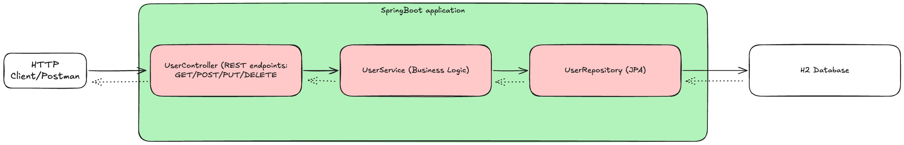

# User Management REST API

A Spring Boot REST API for managing user accounts with full CRUD operations, built with Spring Data JPA and H2 database.

## Features

- Create new user accounts with name and email
- Retrieve user information by ID or list all users
- Update user details
- Delete user accounts
- Email uniqueness validation
- Comprehensive error handling with meaningful HTTP status codes
- H2 database with file-based persistence
- Docker support for easy deployment

## Technologies

- Java 21
- Spring Boot 3.5.7
- Spring Data JPA
- H2 Database
- Maven
- Docker

## Architecture



The application follows a layered architecture with REST controllers handling HTTP requests, a service layer for business logic, JPA repositories for data access, and H2 for persistence.

## Prerequisites

- Java 21 JDK
- Maven 3.6+
- Docker (optional, for containerized deployment)

## Quick Start

### Running Locally

1. Clone the repository
2. Build the project:
   ```bash
   mvn clean install
   ```
3. Run the application:
   ```bash
   mvn spring-boot:run
   ```
4. The API will be available at `http://localhost:8080`

### Running with Docker

1. Build the Docker image:
   ```bash
   docker build -t user-api:1.0 .
   ```
2. Run the container:
   ```bash
   docker run -p 8080:8080 -v $(pwd)/data:/app/data user-api:1.0
   ```

Or use Docker Compose:
```bash
docker-compose up
```

## API Endpoints

### Create User
```bash
POST /api/users
Content-Type: application/json

{
  "name": "John Doe",
  "email": "john@example.com"
}

Response: 201 Created
```

### Get All Users
```bash
GET /api/users

Response: 200 OK
```

### Get User by ID
```bash
GET /api/users/{id}

Response: 200 OK or 404 Not Found
```

### Update User
```bash
PUT /api/users/{id}
Content-Type: application/json

{
  "name": "John Updated",
  "email": "john.updated@example.com"
}

Response: 200 OK or 404 Not Found
```

### Delete User
```bash
DELETE /api/users/{id}

Response: 204 No Content or 404 Not Found
```

## Testing with curl

Create a user:
```bash
curl -X POST http://localhost:8080/api/users \
  -H "Content-Type: application/json" \
  -d '{"name":"Alice Johnson","email":"alice@example.com"}'
```

Get all users:
```bash
curl http://localhost:8080/api/users
```

Get user by ID:
```bash
curl http://localhost:8080/api/users/1
```

Update user:
```bash
curl -X PUT http://localhost:8080/api/users/1 \
  -H "Content-Type: application/json" \
  -d '{"name":"Alice Updated","email":"alice.new@example.com"}'
```

Delete user:
```bash
curl -X DELETE http://localhost:8080/api/users/1
```

## H2 Database Console

Access the H2 console at: `http://localhost:8080/h2-console`

Connection settings:
- JDBC URL: `jdbc:h2:file:./data/userdb`
- Username: `sa`
- Password: (leave empty)

## Error Handling

The API returns consistent error responses:

- `400 Bad Request`: Validation errors (invalid email, missing fields)
- `404 Not Found`: User not found
- `409 Conflict`: Duplicate email address

Example error response:
```json
{
  "timestamp": "2025-10-30T14:30:00",
  "status": 404,
  "error": "Not Found",
  "message": "User with ID 999 not found",
  "path": "/api/users/999"
}
```

## Project Structure

```
src/main/java/com/example/userapi/
├── entity/              # JPA entities
├── repository/          # Spring Data repositories
├── service/             # Business logic
├── controller/          # REST endpoints
├── dto/                 # Data transfer objects
└── exception/           # Custom exceptions and handlers
```

## Configuration

Application settings are in `src/main/resources/application.yml`:
- Database: File-based H2 at `./data/userdb`
- Server port: 8080
- H2 console enabled at `/h2-console`

## License

This is a demo/portfolio project for learning purposes.
